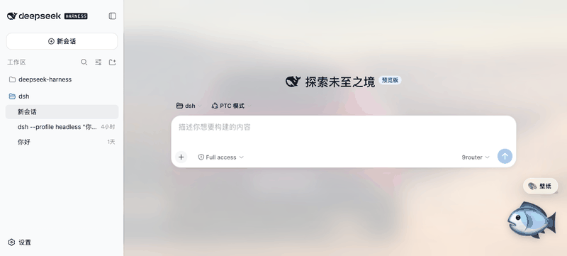

# @tangyuewei/dsh-client-ui-pet

> **咸鱼宠物（Salted Fish Pet）** —— 为 DeepSeek Harness Web UI 打造的桌面宠物插件。一只悬浮在右下角的咸鱼吉祥物，叠加全视口工程师主题壁纸。纯前端展示插件，无服务端行为。

[English](./README_EN.md)

## 简介

`ui-pet` 是一个基于 [Cordis](https://cordis.js.org/) 的客户端 UI 插件（`platform: 'web'`）。它向 DeepSeek Harness（DSH）Web Shell 的 `shell.overlay` 槽位注入两部分内容：

1. **咸鱼宠物**：一只可拖拽、可喂食、会随机吐槽的咸鱼吉祥物；
2. **工程师壁纸**：全视口壁纸（不区分深浅色，丢入 `wallpapers/` 即可入候选），透过透明主题背景显示。

两部分通过模块级共享状态（`visibility.ts`）联动：点击「隐藏咸鱼」会同时收起宠物与壁纸。

## 演示



*演示内容：默认 `yu7` 毛玻璃背景与咸鱼 → 打开壁纸面板 → 切换 Porsche 718 → 📌 置顶（背景图全屏置顶）→ 取消置顶 → 切换 Macan S（深色系壁纸亦可选，深浅色不限制）。*

## 功能特性

### 咸鱼宠物

- **固定锚点**：默认吸附在视口右下角（`MARGIN = 20px` 内边距）。
- **拖拽移动**：按住鱼身拖拽，自动钳制在视口可见区域内；窗口缩放导致越界时自动重新锚定。
- **点击喂食**：点击鱼身恢复饱腹度 +25（上限 100），触发「开心」心情与随机台词。
- **饱腹度系统**：每 30 秒自然衰减 1 点；饿到 0 会自动切换到「有 Bug」心情。
- **8 种心情**：开心 🐟、晕乎乎 🐡、燃烧 🔥、睡着 😴、有 Bug 🐛、续命 ☕、起飞 🚀、摔桌 😡。
- **气泡台词**：每种心情附带程序员笑话 + 开发技巧提示，自动 3 秒消失。
- **闲置自动唠叨**：8–15 秒随机触发一次随机心情与台词。

### 工程师壁纸

- **多壁纸候选**：7 张图（Porsche 718/ Yu7 ×3 / Macan S / Su7 ×2）由 `scripts/build-wallpapers.mjs` 自动缩放到 1920px JPEG 并 base64 编码进 `bg-images.generated.ts`，丢图即可加入候选。
- **不区分主题**：所有壁纸在任何主题下均可选（不再按浅色/深色分组），用户自由挑选；选择全局共享一个 id，写入 `localStorage`（`dsh-ui-pet.wallpaper`）。
- **运行时切换**：右下角 🎨 按钮（`WallpaperPicker`）弹出全部壁纸的缩略图面板，点击即切换；支持 📌 置顶（背景图全屏置顶、面板保持打开可对比，取消置顶返回原状）。
- **默认壁纸**：召唤咸鱼时默认使用 `yu7.jpg`（未做任何选择时）。
- **丢图即生效（开发时）**：跑 `npm run watch` 后，往 `src/client/wallpapers/` 丢入图片会自动重编码并重建，无需手动执行 `npm run bundle`。
- **透出机制**：通过 CSS 变量将主题背景基色设为透明（`--dsw-alias-bg-base: transparent`），壁纸从 `body` 透出，无需额外 DOM 节点或 z-index 争用。
- **玻璃拟态列**：侧边栏与中间列采用半透明 + `backdrop-filter: blur + saturate` 的毛玻璃效果，壁纸色调模糊透出，导航与正文保持可读，呈现现代科技氛围；通过 `[class$="sidebarCol"]` / `[class$="centerCol"]` 结尾选择器命中上层层级（仅依赖 CSS Modules local 名后缀，不依赖哈希前缀），深浅主题分别适配透明度（浅色 centerCol 不透明度 0.74 + 22px 模糊以保障文字可读）。
- **鼠标跟随**：`mousemove`（`passive`）实时写入 `--bg-mx/--bg-my` CSS 变量，为鼠标跟随光晕（见 `Background.tsx` 的 `EngineerBackground`）提供定位。

### 召唤 / 隐藏

- 顶部导航栏「Session log」按钮左侧内联一个 **召唤咸鱼 / 隐藏咸鱼** 按钮（由宠物组件动态定位）。
- 点击一次隐藏宠物**同时**移除背景壁纸，恢复原主题背景。
- 再次点击召唤，宠物与背景同步恢复。

## 架构定位

| 层级 | 说明 |
|------|------|
| **包类型** | 纯客户端 UI 插件（`platform: 'web'`） |
| **宿主端行为** | 无（`src/index.ts` 仅导出空 `apply()` 以满足 Cordis Loader） |
| **浏览器端入口** | `exports["./client"]` → `src/client/index.ts` |
| **槽位注册** | `shell.overlay`，条目 `id: 'uiPet'`（宠物组件） |
| **壁纸挂载** | 在 `src/client/index.ts` 的 `apply()` 内直接作用于 `body`，非独立槽位 |
| **共享状态** | `visibility.ts` 模块级 store 同步宠物与背景的显隐 |

### 目录结构

```
src/
├── index.ts                 # 宿主端入口（空 apply）
├── invariant.ts             # 插件不变量占位
├── client/
│   ├── index.ts             # 浏览器端插件：壁纸 + 毛玻璃 + 槽位注册
│   ├── SaltedFishPet.tsx    # 咸鱼宠物 React 组件
│   ├── WallpaperPicker.tsx  # 右下角 🎨 浮动按钮 + 缩略图选择面板
│   ├── visibility.ts        # 宠物/背景共享显隐状态
│   ├── bg-images.ts         # 壁纸 API：WALLPAPERS + localStorage 持久化 + 事件总线
│   ├── bg-image.ts          # 旧版单壁纸常量（BG_IMAGE，遗留）
│   ├── Background.tsx       # 工程师壁纸组件（EngineerBackground，遗留）
│   ├── SaltedFishPet.module.css
│   ├── Background.module.css
│   ├── WallpaperPicker.module.css
│   └── wallpapers/           # 壁纸源图目录：丢图 + npm run bundle 自动加入候选
│       ├── porsche-718.jpg
│       ├── mcan-s.jpg
│       ├── yu7-3.jpg
│       ├── yu7.jpg
│       ├── yu7-gt.jpg
│       ├── su7-1.png
│       └── su7.png
└── css-modules.d.ts

scripts/
└── build-wallpapers.mjs      # prebuild：扫描 wallpapers/ → sips 缩放 → base64 → bg-images.generated.ts
```

## 安装方式

### 方式 A：npm 发布版（`npx @deepseek-ai/dsh web` 用户）

如果你是通过 `npx @deepseek-ai/dsh web` 运行 DeepSeek Harness（未 clone 源码），请使用 DSH 自带的 **profile 插件管理命令**安装本插件，**不需要** clone 仓库或运行 `install.sh`（`install.sh` 仅适用于源码场景）：

```bash
npx @deepseek-ai/dsh plugin --profile web add @tangyuewei/dsh-client-ui-pet
```

> **前提**：本机需安装 `pnpm`（`dsh plugin add` 本质是在 profile 目录内执行 `pnpm add`）。

该命令做的事情：

1. 首次运行会自动初始化**持久化 profile 目录 `~/.dsh/profiles/web`**（与 npx 缓存无关，重开终端 / 重跑 npx 依然生效）；
2. 在该目录内执行 `pnpm add @tangyuewei/dsh-client-ui-pet` 安装插件及其 peer 依赖；
3. 因插件声明了 `dsh.bundle.patch`，包名会自动追加进 profile 的 `dsh.profile.bundles` 清单；
4. 之后 `npx @deepseek-ai/dsh web` 启动时，DSH 会按 bundle 顺序叠加插件的 `cordis.patch.yml`，在 `shell.overlay` 注入咸鱼宠物与壁纸。

安装完成后重新启动 `npx @deepseek-ai/dsh web`，即可在右下角看到咸鱼宠物与工程师壁纸（可通过 Settings → Plugins 确认插件已启用）。

如需卸载：

```bash
npx @deepseek-ai/dsh plugin --profile web remove @tangyuewei/dsh-client-ui-pet
```

### 方式 B：从源码编译 DeepSeek Harness

以下步骤适用于从 DeepSeek Harness 源码启动的场景。克隆官方仓库后确保能正常 `pnpm dsh web` 启动。

### 步骤一：将插件放入 client 目录

```bash
cd $DSH_HOME/packages/client/
git clone https://github.com/tangyuewei/dsh-client-ui-pet.git
```

> clone 后目录名即为 `dsh-client-ui-pet`，无需重命名，也无需在插件目录内单独构建；构建由步骤二的一键脚本统一完成。

### 步骤二：运行一键安装脚本

```bash
cd dsh-client-ui-pet
bash install.sh
```

脚本自动完成注册、安装依赖与构建，逐步输出进度，任一步失败会打印 `[ERROR]` 提示并中断（退出码非 0），无需手动编辑任何文件：

1. **校验环境**：检查 `git` / `node` / `pnpm` 可用，并校验 DSH 源码目录结构完整；
2. **自动定位 DSH_HOME**：默认取脚本所在目录的上三级（`dsh-client-ui-pet` → `packages/client` → `packages` → `$DSH_HOME`）；若 DSH 源码不在该位置，可用环境变量覆盖：`DSH_HOME=/path/to/dsh bash install.sh`；
3. **注册依赖**：在 `packages/bundle/web-app/package.json` 的 `dependencies` 中添加 `@tangyuewei/dsh-client-ui-pet: "workspace:^"`；
4. **注册插件条目**：在 `packages/bundle/web-app/cordis.patch.yml` 的 `- insert:` 块末尾追加插件条目（id 与 name 从插件自身 `package.json` / `cordis.patch.yml` 自动读取，无需手动同步）；
5. **安装依赖并构建**：回到 `$DSH_HOME` 依次执行 `pnpm install` 与 `pnpm run build`。

> 脚本幂等：注册条目已存在时会自动跳过，重复运行安全；修复问题后可随时重跑。

### 步骤三：启动

```bash
pnpm dsh web
```

插件加载后可在浏览器中看到右下角的咸鱼宠物与工程师壁纸。可通过 Settings → Plugins 确认 `@tangyuewei/dsh-client-ui-pet` 已启用。

### 步骤四：卸载（源码场景）

若需从源码工作区移除本插件，运行仓库内的一键卸载脚本即可，它会精确反向 `install.sh` 的全部写操作：

```bash
cd dsh-client-ui-pet
bash uninstall.sh
```

脚本依次执行：

1. 从 `packages/bundle/web-app/package.json` 的 `dependencies` 移除插件依赖；
2. 从 `packages/bundle/web-app/cordis.patch.yml` 的插件条目（`- id: ui-pet`）移除；
3. 重新执行 `pnpm install` 与 `pnpm run build`，使 DSH 工作区恢复一致。

脚本特性：

- **幂等**：插件未注册时自动跳过对应步骤，可安全重跑；每次执行结束会校验两处注册均已消失；
- **预演**：`bash uninstall.sh --dry-run` 只报告将要变更的内容，不修改任何文件；
- **跳过重建**：`bash uninstall.sh --no-rebuild` 仅撤销注册、不重新 `install` / `build`（适合临时禁用）；
- **指定 DSH_HOME**：与 `install.sh` 一致，可用 `DSH_HOME=/path/to/dsh bash uninstall.sh` 覆盖路径；
- **注意**：插件源码目录本身不会被删除，仅从 `web-app` 注销；需要时可重新运行 `bash install.sh` 恢复。

## 自定义配置

| 文件 | 可修改内容 |
|------|------------|
| `src/client/SaltedFishPet.tsx` | `MOODS`（emoji/tag）、`SPEECH` 台词库、饱腹度衰减间隔、闲置触发间隔、鱼尺寸（`PET_W`/`PET_H`）与边距（`MARGIN`） |
| `src/client/bg-images.ts` | 壁纸 API：全局选择（theme-agnostic）、localStorage 持久化、事件总线 |
| `src/client/wallpapers/` | 壁纸源图目录，丢入图片即可自动加入候选（prebuild 缩放 + base64 编码，见下方「添加 / 更换壁纸」） |
| `src/client/index.ts` | 透明背景变量名、鼠标跟随变量、壁纸应用逻辑、玻璃拟态列、用户选择事件总线 |
| `src/client/WallpaperPicker.tsx` · `WallpaperPicker.module.css` | 浮动 🎨 按钮 + 全部壁纸缩略图弹窗（运行时切换、置顶） |
| `src/client/SaltedFishPet.module.css` · `Background.module.css` | 宠物 / 气泡 / 饱腹度条样式、动画关键帧 |

### 常见调整示例

**修改饱腹度衰减速度**（`SaltedFishPet.tsx`）：

```ts
// 原：每 30 秒 -1
setHunger(h => Math.max(0, h - 1))
}, 30000)
// 改：每 60 秒 -1
}, 60000)
```

**添加 / 更换壁纸**

把图片丢到 `src/client/wallpapers/`，文件名作为 id（如 `yu7.jpg` → id `yu7`）：

```bash
# 开发（推荐）：一次性启动，之后丢图自动重编码 + 重建
npm run watch

# 或一次性构建
npm run bundle   # = node scripts/build-wallpapers.mjs && tsdown
```

prebuild 脚本会用 `sips`（macOS）把每张图缩放到 1920px 宽 + 转为 JPEG，base64 编码到 `bg-images.generated.ts`（gitignored，每次构建自动重新生成），然后 `tsdown` 把新内容打进 `lib/client.js`。**完全不需要手动跑 base64 编码。**

壁纸显示名在 `scripts/build-wallpapers.mjs` 顶部的 `META` 映射中维护（不再区分深浅主题，全部壁纸对所有主题可见）：

```js
const META = {
  'porsche-718': { name: 'Porsche 718' },
  'yu7':         { name: 'Yu7 · 公路' },
  'mcan-s':      { name: 'Macan S' },
  // ...
}
```

**更换默认壁纸**（`src/client/bg-images.ts`）：修改 `DEFAULT_WALLPAPER_ID` 为任意壁纸 id 即可（默认 `yu7`）。

**运行时切换**：右下角 🎨 按钮 → 全部壁纸缩略图面板（深浅色不限制）→ 点击即切换并写入 localStorage（`dsh-ui-pet.wallpaper`），刷新与重启后保留。

## 兼容性说明

- **仅 Web 平台**：`package.json` 声明 `dsh.client.platform: 'web'`，无 Node / CLI / ACP 入口。
- **零依赖服务**：不消费任何 Cordis 服务（仅依赖 `slots` 槽位注入），纯 React 组件 + 模块级 store。
- **样式隔离**：CSS Modules（`SaltedFishPet.module.css`、`Background.module.css`），无全局污染。
- **主题联动**：依赖 DSH Web Shell 的 `body[data-ds-dark-theme]` 属性切换。

## 已知限制

- **无持久化**：宠物位置、饱腹度、心情、显隐状态均为会话级内存，刷新即重置。
- **无配置面板**：所有参数需改源码重新构建，未暴露给用户设置。
- **壁纸候选统一管理**：所有候选壁纸（不区分深浅色）以 base64 内嵌于 `bg-images.generated.ts`（prebuild 自动生成），无外部请求；如需动态加载需自行改造。
- **召唤按钮定位依赖 DOM 查找**：通过查找「Session log」按钮定位，若 Shell 结构变更可能失效。
- **无障碍支持有限**：宠物交互区标注 `role="button"` 与 `tabIndex`，但缺少完整 ARIA 属性与键盘操作。
- **光晕为遗留实现**：鼠标跟随光晕样式定义在未挂载的 `Background.tsx`（`EngineerBackground`），当前壁纸路径不渲染光晕。

## 许可证

MIT